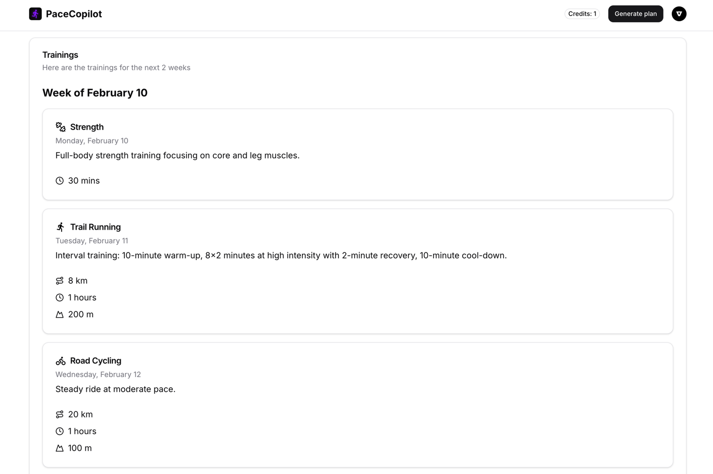

 

  

<h3 align="center">Pace Copilot</h3>

  

An AI-powered tool to generate personalized training plans for runners.
 
    <a href="https://pacecopilot.mariusbrt.com/"><strong>Test it now »</strong></a>
    

## About The Project

Pace Copilot is an AI-powered running coach that generates personalized training plans to help users achieve their
goals. By analyzing their running history, it creates a tailored plan that adapts to their fitness level, goals, and
training volume. The tool provides detailed workouts, including road running, trail running, strength training, and road
biking.

### Built With

- Next.js
- Typescript
- AI SDK
- OpenAI
- Clerk
- Zod
- Prisma
- TailwindCSS
- Shadcn UI

## License

Distributed under the GNU GPLv3 License. See `LICENSE.txt` for more information.

## Contact

- [Portfolio](https://mariusbrt.com)
- [LinkedIn](https://www.linkedin.com/in/mariusbrt/)
